

DermaScope is a capstone project built for Coding Camp 2026 powered by DBS Foundation. The platform helps users perform an initial skin scan, review AI-assisted risk information, chat with a dermatology assistant, find nearby clinics, and track their scan history in one integrated web experience.

> Medical disclaimer: DermaScope is designed for education and early screening support. It is not a replacement for professional medical diagnosis, treatment, or consultation with certified healthcare providers.

## Team

Built by Team PSU288 for Coding Camp 2026 powered by DBS Foundation.

| Full Stack                                                                                                                                                | AI Engineer                                                                                                                              | Data Science                                                                                                                                          |
| --------------------------------------------------------------------------------------------------------------------------------------------------------- | ---------------------------------------------------------------------------------------------------------------------------------------- | ----------------------------------------------------------------------------------------------------------------------------------------------------- |
| Muhammad Brillian Mujahid Kamal &nbsp;  | Raymond Surya Setiawan &nbsp;  | Leilani Najma Rachmawati &nbsp;  |
| Yusuf Saputrah &nbsp;                                     | Rizky Irswanda Ramadhana &nbsp;         | Rofiatul Qosimah &nbsp;                             |

## Project Theme

DermaScope supports the **Healthy Lives & Well-being** theme by helping users become more aware of potential skin risks and encouraging timely consultation with healthcare professionals.

## What We Build

DermaScope focuses on accessible skin-health awareness through a connected web, backend, data, and machine learning system.

- **AI Skin Scan**: upload a skin image and supporting clinical data to receive an AI-assisted classification result.
- **Risk Triage**: combine model output and symptom data into a practical risk recommendation.
- **Clinical Chat**: ask educational questions about skin conditions through an AI assistant.
- **Nearby Clinics**: search and view nearby clinics on an interactive map.
- **Scan History**: save previous scan results and export user health reports.
- **Data-Driven Model Development**: analyze HAM10000, prepare processed datasets, train a multi-input TensorFlow model, and serve it through FastAPI.

## Tech Stack

| Repository                                                                       | Scope                                                                     | Main Tech                         |
| -------------------------------------------------------------------------------- | ------------------------------------------------------------------------- | --------------------------------- |
| [Front-End](https://github.com/DermaScope/Front-End-FS)                          | User-facing web app, scan UI, chat UI, clinic map, history, profile       | React, Vite, Tailwind CSS         |
| [Back-End](https://github.com/DermaScope/Backend-FS)                             | REST API, authentication, scan history, chatbot integration, image access | Node.js, Express, PostgreSQL      |
| [AI Inference](https://github.com/Capstone-Project-CC26-PSU288/inference-server) | Model serving API for prediction and triage                               | FastAPI, TensorFlow, Docker       |
| [Model Development](https://github.com/Capstone-Project-CC26-PSU288/ai-engineer) | Model training notebook and exported Keras artifacts                      | TensorFlow, Keras, EfficientNetB0 |
| [Data Science](https://github.com/Capstone-Project-CC26-PSU288/data-science)     | EDA, data wrangling, dashboard, feature engineering, A/B testing          | Python, Pandas, Streamlit         |

## Product Preview

<table>
  <tr>
    <td><strong>Landing Page</strong> Public entry point that introduces AI skin scanning, key benefits, supported skin conditions, reviews, and medical disclaimer.</td>
  </tr>
  <tr>
    <td width="50%">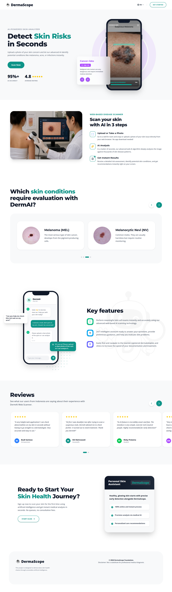</td>
  </tr>
</table>

<table>
  <tr>
    <td><strong>Home Dashboard</strong> Personal service hub for authenticated users to access scan, clinics, chat, and history features.</td>
  </tr>
  <tr>
    <td width="50%">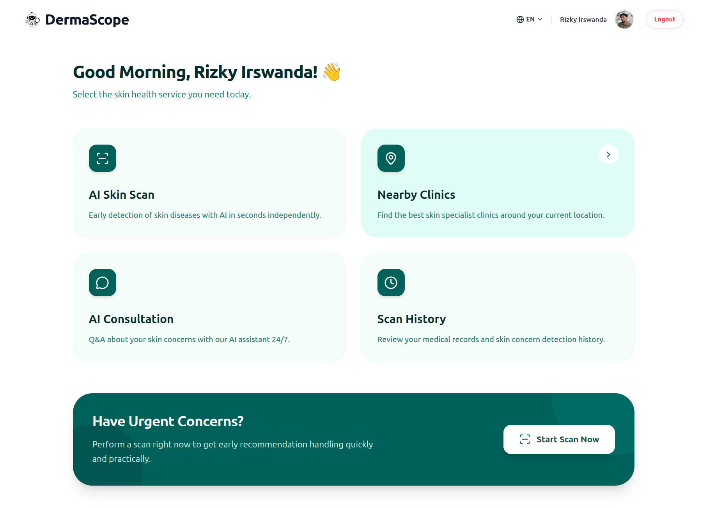</td>
  </tr>
</table>

## Core Feature: AI Skin Scan

<table>
  <tr>
    <td><strong>1. Upload Image</strong> Users upload a clear photo of the affected skin area.</td>
    <td><strong>2. Add Clinical Data</strong> Users complete age, gender, lesion area, complaint duration, itch level, and pain level.</td>
    <td><strong>3. Review Result</strong> The system displays predicted class, confidence level, risk status, and initial care suggestions.</td>
  </tr>
  <tr>
    <td width="33%">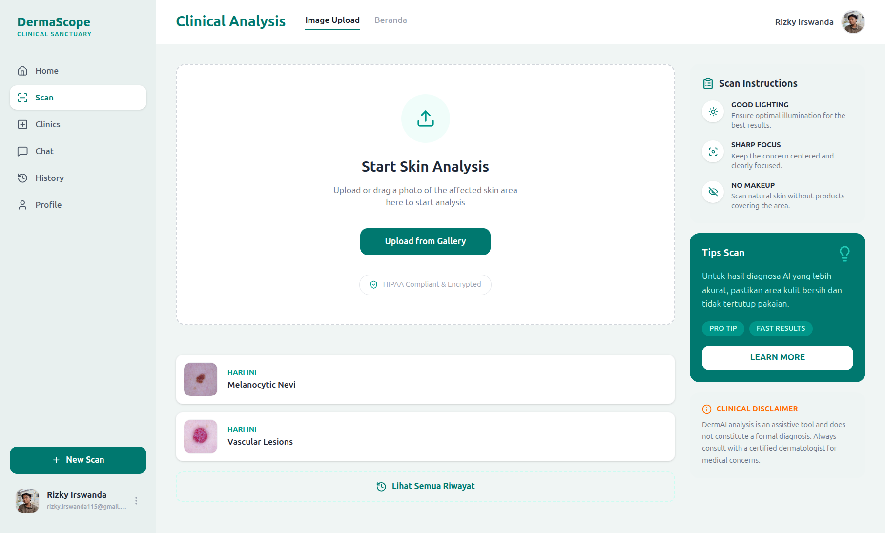</td>
    <td width="33%">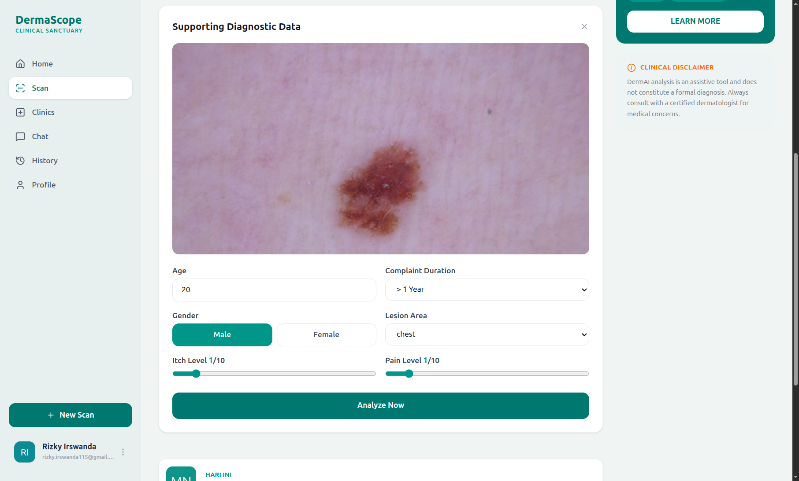</td>
    <td width="33%">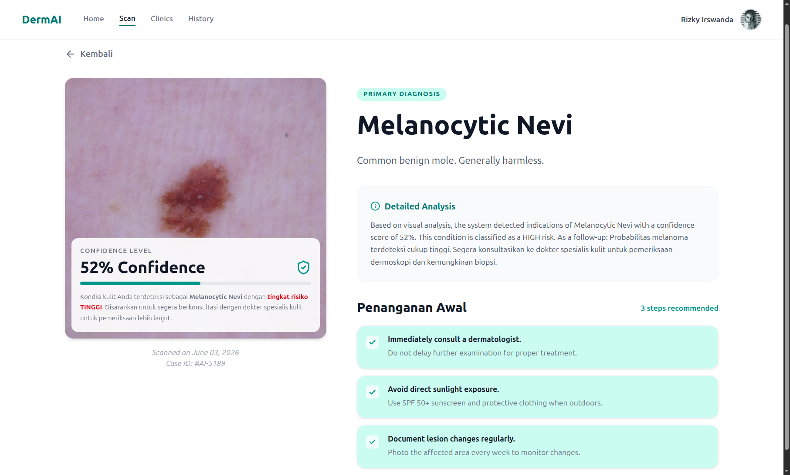</td>
  </tr>
</table>

## Other Key Features

<table>
  <tr>
    <td><strong>Login</strong> Email/password and Google sign-in with privacy, accessibility, and medical-standard messaging.</td>
    <td><strong>Register</strong> Account creation page for new users joining the DermaScope early skin-health experience.</td>
  </tr>
  <tr>
    <td width="50%">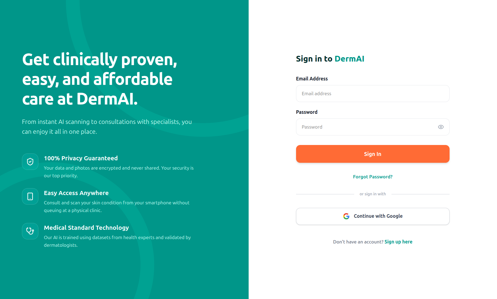</td>
    <td width="50%">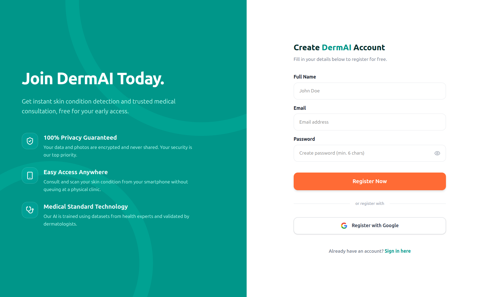</td>
  </tr>
  <tr>
    <td><strong>Nearby Clinics</strong> Interactive map and clinic list to help users find nearby healthcare facilities.</td>
    <td><strong>Clinical Chat</strong> Educational AI chat experience with clear medical disclaimer and quick actions.</td>
  </tr>
  <tr>
    <td width="50%">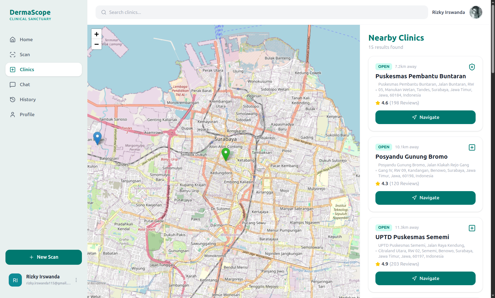</td>
    <td width="50%">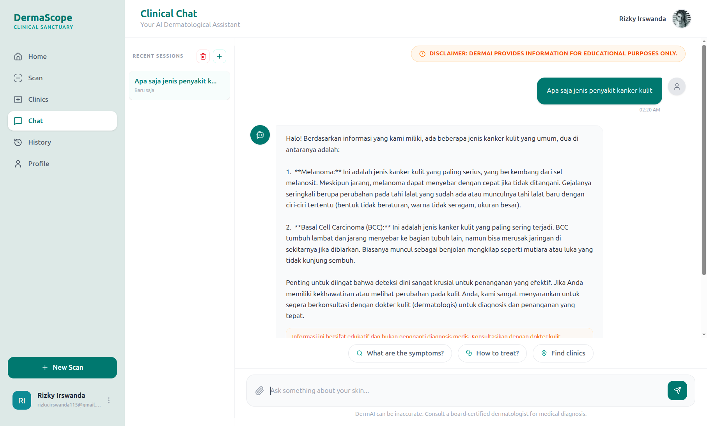</td>
  </tr>
  <tr>
    <td><strong>Scan History</strong> Longitudinal view of past diagnoses, confidence scores, and report export access.</td>
    <td><strong>Profile Settings</strong> User identity, monitoring progress, security status, and data export controls.</td>
  </tr>
  <tr>
    <td width="50%">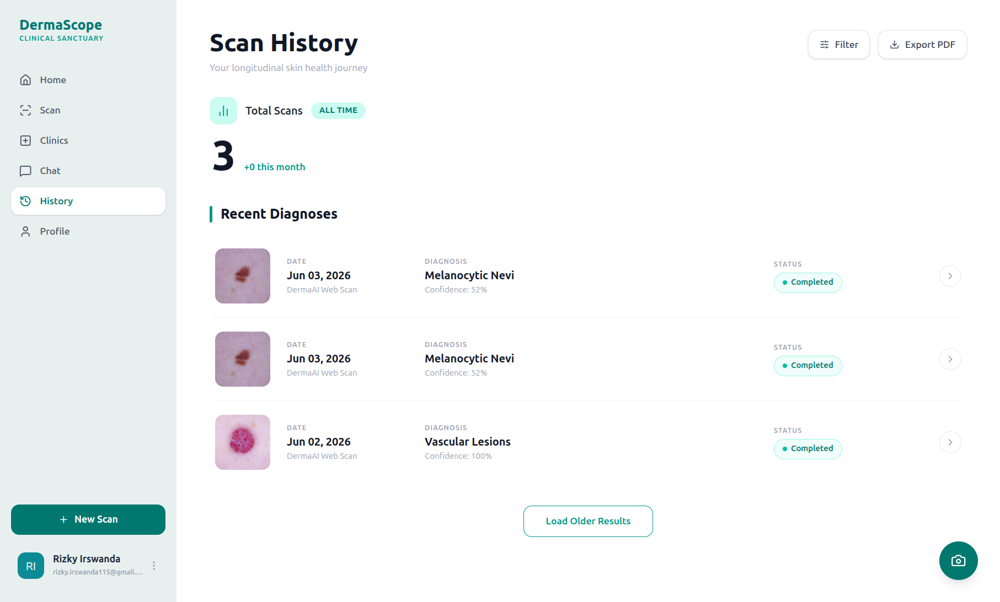</td>
    <td width="50%">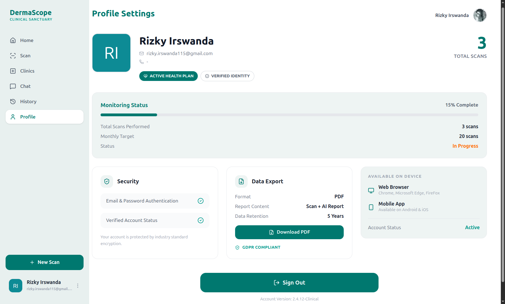</td>
  </tr>
</table>
